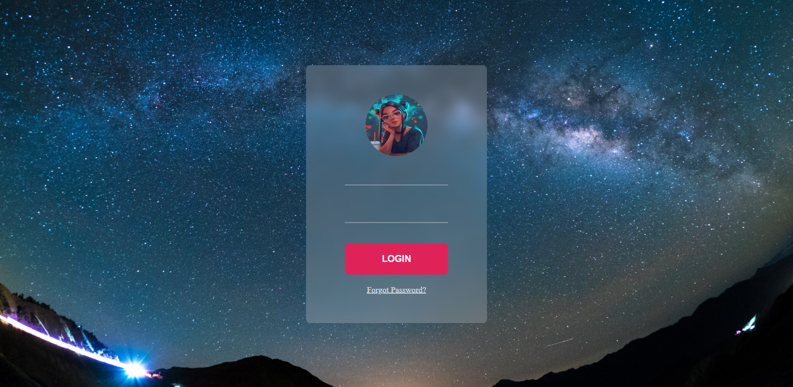

# Frosted glass effect Login form
This project involved creating a Login form with Frosted Glass Effect against the background image using HTML and CSS.

--- 
## Something new that I learnt while building this project are:
- Filter property: blur(),brightness(),contrast() and many other values
- input[type="submit"] 
- inherit property
- Background property's multiple shorthand values

---
## The Outcome:

