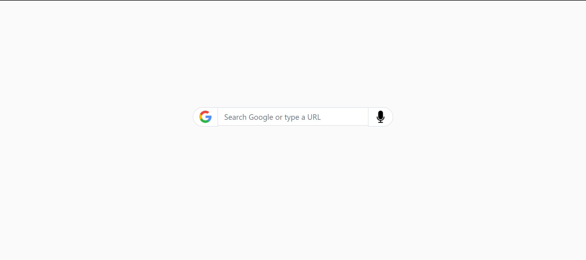

# Google Type Searchbox
 The project involves a Responsive Google Type Searchbox made using CSS and Bootstrap.

---
## Something new that I learnt while building this project are:
- input-group class
- d-flex
- input-group-append and input-group-prepend 
- outline property

---
## The Outcome:

