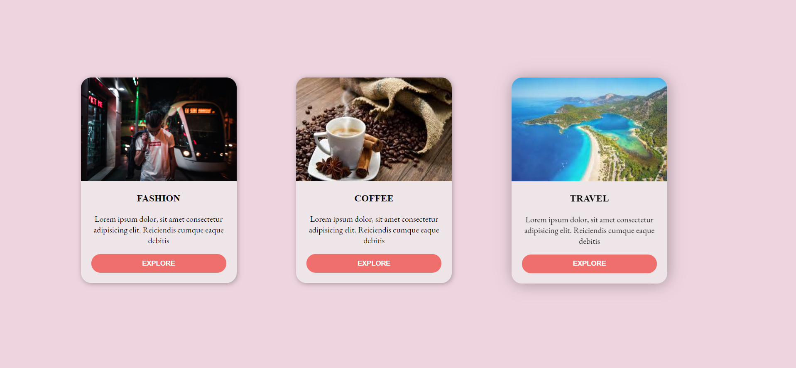

# Responsive Cards
The project was an implementation of Responsive Cards using CSS Grid Layout.

---
## Something new that I learnt while building this project are:
- Align-items property and its values: stretch, center, baseline, flex-start, flex-end
- Main class
- border-top-left-radius and border-top-right-radius property
- @media queries to tailor for different devices

---
## The Outcome:

