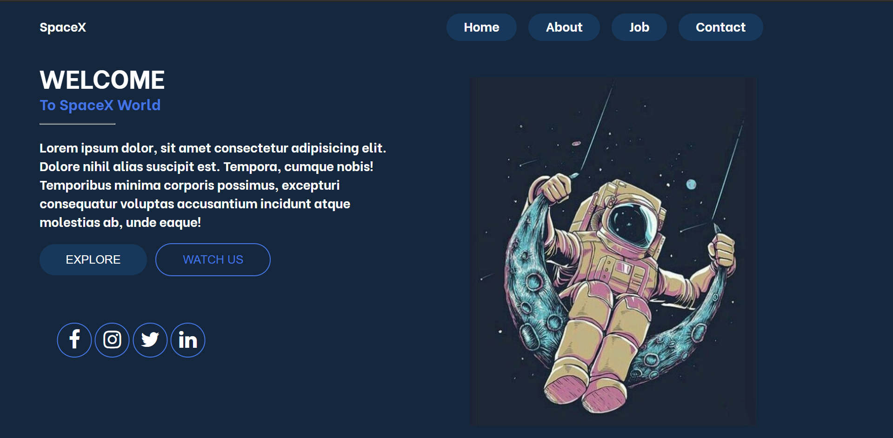

# Space Project
This project was a try to create a Landing Page for SpaceX organisation.
It consists of Responsive Navbar, buttons and icons.

---
## Something new that I learnt while building this project is:
- How to use Grid Layout effectively
- nth-child property
- not property
- first-of-type property
- Transition property in detail

---
## The Outcome:

